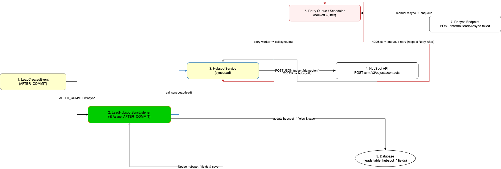

# HubSpot Integration Flow
- **Owner:** _TBD_
- **Last updated:** 2025-10-01

## Purpose
Capture the end-to-end integration between the BeWorking lead system and HubSpot, including payload structure, retry strategy, and operational guidance. Mirrors the HubSpot sync diagram from the backend repository.

## High-Level Flow
1. `LeadCreatedEvent` (after DB commit) signals a new lead.
2. `LeadHubspotSyncListener` invokes `HubspotService.syncLead`.
3. HubSpot API returns success, rate limit, or error codes.
4. Listener updates persistence and triggers retries or alerts.

## Detailed Flow (Diagram Aligned)
1. **LeadCreatedEvent (AFTER_COMMIT)** is published once a lead persists successfully.
2. **LeadHubspotSyncListener (@Async)** loads the latest lead snapshot and calls `HubspotService.syncLead(lead)`.
3. **HubspotService** builds the contact payload and issues `POST https://api.hubapi.com/crm/v3/objects/contacts` with bearer auth.
4. **HubSpot API** responds with hubspotId on success or error codes (`429`, `5xx`, `4xx`).
5. **Retry Queue / Scheduler** handles transient errors with backoff+jitter, respecting `Retry-After` headers.
6. **Manual Resync Endpoint** (`POST /internal/leads/resync-failed`) enqueues failed leads for reconciliation.
7. **Database Update** writes hubspot-related columns on the lead (`hubspot_id`, status, attempts, timestamps, error text).

## Payload Reference
Example request body:
```json
{
  "properties": {
    "email": "ana@example.com",
    "firstname": "Ana",
    "phone": "+341234567",
    "message": "Interested in ..."
  }
}
```

## Error Handling & Idempotency
- 429 / 5xx → retry with exponential backoff and jitter; surface metrics when retries exceed thresholds.
- 4xx → mark lead as `FAILED`, log error, and rely on manual resync if appropriate.
- Use HubSpot search-by-email or PATCH to avoid duplicates on retries.

## Tests & QA
- Unit: cover success, 4xx, 429, 5xx paths with WireMock or mocked `RestTemplate`.
- Listener: persist a lead, publish event, assert HubSpot sync and DB column updates.
- Integration: end-to-end scenario with local DB and mocked HubSpot service.

## Required Database Columns
Ensure Flyway migrations add:
- `hubspot_id` VARCHAR(255)
- `hubspot_sync_status` VARCHAR(32)
- `hubspot_synced_at` TIMESTAMP
- `hubspot_error` TEXT
- `hubspot_sync_attempts` INT
- `last_hubspot_attempt_at` TIMESTAMP

## Observability & Runbook
- Metrics: sync attempts, failure rate, retry count, latency.
- Logs: include lead id, hubspot id, http status, truncated error message.
- Secrets: keep `HUBSPOT_TOKEN` in env/secret manager; never log it.
- Manual recovery: rotate credentials, inspect failed queue, trigger `resync-failed` endpoint.

## Diagram
- Source: `../../diagrams/draw.hubspot.txt`
- Export: `../../diagrams/hubspot.drawio.png`



## Follow-ups
- [ ] Add WireMock-based tests for 200/400/429/500 scenarios.
- [ ] Implement durable job queue for retries if not already in place.

## Next Improvements
- Add a durable job queue for retries if transient errors accumulate.
- Build background reconciliation to requeue long-lived FAILED leads.
- Capture metrics in Grafana/Prometheus dashboards for visibility.
