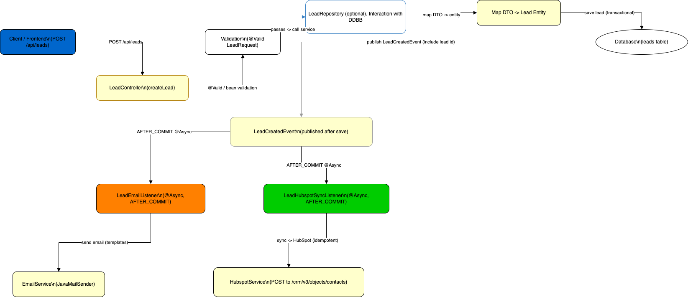

# Lead Intake Process
- **Owner:** _TBD_
- **Last updated:** 2025-10-01

## Purpose
Describe the backend flow for capturing inbound leads, persisting them, and kicking off downstream email and HubSpot sync automation. This documentation aligns with the lead process diagram migrated from the backend repo.

## High-Level Flow
1. Client submits `POST /api/leads` with lead details.
2. Backend validates and persists the `Lead` entity.
3. After commit, async listeners trigger emails and HubSpot synchronisation.
4. Observability and retries keep external systems in sync.

## Detailed Flow (Component → Component)
1. **Client ➜ LeadController**: receives JSON payload mapped to `LeadRequest` DTO.
2. **Validation**: `@Valid` guards return 400/422 when fields are missing or malformed.
3. **LeadService (optional)**: deduplicates by email, normalises source, enriches metadata.
4. **Mapping ➜ Persistence**: DTO converted to `Lead` entity; defaults such as `hubspot_sync_status=PENDING` applied.
5. **LeadRepository.save**: inserts row into `leads` table.
6. **LeadCreatedEvent**: published with `AFTER_COMMIT` semantics to avoid phantom events.
7. **LeadEmailListener (@Async)**: assembles templates and dispatches internal/external notifications.
8. **LeadHubspotSyncListener (@Async)**: loads lead and calls `HubspotService.syncLead`.
9. **HubspotService.syncLead ➜ HubSpot API**: builds JSON payload (`email`, `firstname`, `phone`, `message`, ...), handles 200/201, 4xx, 429, 5xx responses.
10. **LeadHubspotSyncListener updates Lead**: sets `hubspot_id`, `hubspot_sync_status`, timestamps, attempts, and `hubspot_error` as needed.
11. **Observability**: confirm DB row, inspect logs for listeners, verify HubSpot contact creation, monitor retry queue.

## Systems & Services
- REST Controller & DTOs: `LeadController.java`, `LeadRequest.java`.
- Business layer: `LeadService.java` (if present for dedupe/enrichment).
- Persistence: `Lead.java`, `LeadRepository.java`.
- Events: `LeadCreatedEvent.java`.
- Listeners: `LeadEmailListener.java`, `LeadHubspotSyncListener.java`.
- Integrations: `HubspotService.java`, external HubSpot API, email service.

## Database Fields
- `leads` table plus HubSpot sync columns:
  - `hubspot_id` VARCHAR(255)
  - `hubspot_sync_status` VARCHAR(32) (`PENDING|SYNCED|FAILED`)
  - `hubspot_synced_at` TIMESTAMP
  - `hubspot_error` TEXT
  - `hubspot_sync_attempts` INT
  - `last_hubspot_attempt_at` TIMESTAMP

## Error Handling & Idempotency
- Use retry with backoff for 429/5xx responses.
- Treat 4xx as permanent failures and log context.
- Support manual resync endpoint (`POST /internal/leads/resync-failed`).
- Prefer HubSpot upsert/search-by-email to avoid duplicate contacts.

## Monitoring & Runbook
- Metrics: sync success rate, retry volume, listener latency.
- Logs: include lead id, hubspot id, status code, error details (sanitised).
- Manual tooling: inspect failed leads, rotate API token, trigger resync.

## Diagram
- Source: `../../diagrams/draw.leads.txt`
- Export: `../../diagrams/leads.drawio.png`

## Follow-ups
- [ ] Verify retry/backoff implementation against requirements.
- [ ] Add integration test coverage for listener happy-path and failure modes.
