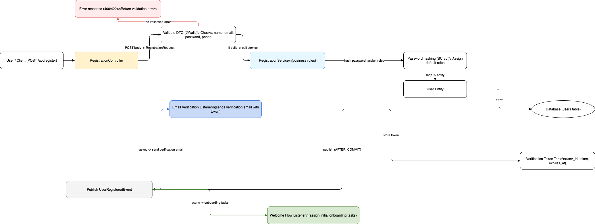

# Registration Process
- **Owner:** _TBD_
- **Last updated:** 2025-10-01

## Purpose
Document the end-to-end onboarding journey from the moment a user submits registration details through account activation. This write-up mirrors the registration diagram and backs up the implementation inside `beworking-backend-java` and the frontend sign-up flow.

## High-Level Flow
1. User submits the registration form (`POST /api/register`).
2. Backend validates, persists the user, and generates verification material.
3. Post-commit events trigger email and onboarding automation.
4. User verifies the account and transitions into the login experience.

## Detailed Flow (Diagram Aligned)
1. **Client** sends registration payload (name, email, password, phone).
2. **RegistrationController** converts JSON into `RegistrationRequest`, applies `@Valid`, and returns 400/422 on validation errors.
3. **RegistrationService** hashes the password (BCrypt), assigns default roles, maps to `User` entity, and persists via `UserRepository`.
4. **Verification Token** is generated with expiry and stored in `verification_token` table.
5. **UserRegisteredEvent** is published after the transaction commits (`@TransactionalEventListener(AFTER_COMMIT)`).
6. **EmailVerificationListener** reacts asynchronously, sending the verification email that contains the token link.
7. **WelcomeFlowListener** assigns onboarding tasks or default workspace artefacts.
8. **Verification endpoint** consumes the token, marks the user verified, and hands off to login.

## Systems & Services
- Frontend: `beworking-frontend/src/components/login/SigninCard.js` captures credentials and surfaces errors.
- Backend controllers: `beworking-backend-java/src/main/java/com/beworking/auth/RegistrationController.java` and `AuthController.java`.
- Business logic: `RegistrationService`, `UserRepository`, password encoder configuration.
- Messaging: `UserRegisteredEvent`, `EmailVerificationListener`, `WelcomeFlowListener`.
- External: transactional email provider for verification mail.

## Database & Entities
- `users` table stores the registered account with hashed password and roles.
- `verification_token` table records token, user reference, and expiry timestamp.
- Entities: `User`, `VerificationToken`.

## Error Handling & Edge Cases
- Validation failures return structured 4xx responses.
- Handle duplicate email by rejecting or linking to resend verification.
- Token expiry/resend workflow ensures users can recover stalled registrations.

## Implementation Notes
```java
class RegistrationRequest { String name; String email; String password; String phone; }
class User { /* ... */ }
class VerificationToken { Long userId; String token; Instant expiresAt; }
void register(RegistrationRequest req);
void sendVerificationEmail(User user, String token);
void assignOnboardingTasks(User user);
```

## Monitoring & Runbook
- Track registration error rate, email delivery failures, and token resend volume.
- Log context-rich errors (request id, tenant, user email) while redacting sensitive fields.
- Provide manual resend endpoint or admin tool to regenerate verification links.

## Diagram
- Source: `../../diagrams/draw.registration.txt`
- Export: `../../diagrams/registration.drawio.png`



## Follow-ups
- [ ] Confirm the diagram reflects the latest listeners and onboarding logic.
- [ ] Link to integration tests once established.
